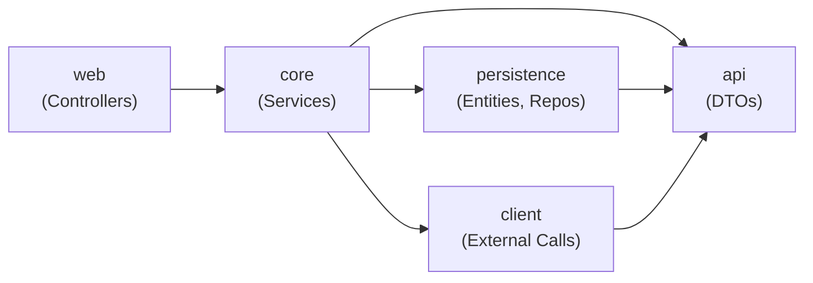

# Template Project Customization Guide

## Overview

This guide provides step-by-step instructions for customizing the Spring Boot Web Service Template to fit your specific needs. The template is organized into several Maven modules that handle different application layers, allowing you to remove unnecessary modules and adapt the project structure to your requirements.

### Project Architecture

The template follows a layered architecture organized into the following Maven modules:

```
┌─────────────────────────────────────────┐
│        template-project-web             │  (REST Controllers, Web Configuration)
├─────────────────────────────────────────┤
│        template-project-core            │  (Business Logic, Services, Mappers)
├─────────────────────────────────────────┤
│   ┌─────────────────┬───────────────┐   │
│   │  template-api   │ template-pers │   │  (API DTOs | Database Access)
│   └─────────────────┴───────────────┘   │
│   ┌──────────────────────────────────┐   │
│   │   template-project-client        │   │  (Optional: External Service Calls)
│   └──────────────────────────────────┘   │
└─────────────────────────────────────────┘

Additional Modules:
- template-project-jacoco-report         (Code Coverage Report Aggregation)
```

### Module Dependencies



---

## Part 1: Project and Package Renaming

Before removing any modules, you should rename the project and Java packages to match your organization and project name.

### Step 1.1: Update Parent POM Project Identity

Edit `pom.xml` in the root directory:

**Find and replace:**
- `<groupId>com.example</groupId>` → `<groupId>com.yourcompany</groupId>` (or your organization)
- `<artifactId>template-project</artifactId>` → `<artifactId>your-project-name</artifactId>`
- `<name>A template project.</name>` → `<name>Your Project Description</name>`
- `<description>Template for a simple SpringBoot web service written in Kotlin.</description>` → Your description

**Example:**
```xml
<groupId>com.acme</groupId>
<artifactId>inventory-service</artifactId>
<name>Inventory Management Service</name>
<description>A microservice for managing product inventory.</description>
```

### Step 1.2: Update Individual Module POMs

For each module (api, persistence, client, core, web, jacoco-report), update the `pom.xml`:

1. **Verify parent reference** (should remain pointing to the root project):
   ```xml
   <parent>
       <groupId>com.yourcompany</groupId>
       <artifactId>your-project-name</artifactId>
       <version>0.0.1-SNAPSHOT</version>
   </parent>
   ```

2. **Update artifactId** (if desired):
   ```xml
   <!-- Before -->
   <artifactId>template-project-api</artifactId>
   
   <!-- After -->
   <artifactId>inventory-service-api</artifactId>
   ```

3. **Update module references** in dependencies:
   ```xml
   <!-- Before -->
   <dependency>
       <groupId>com.example</groupId>
       <artifactId>template-project-core</artifactId>
       <version>${project.parent.version}</version>
   </dependency>
   
   <!-- After -->
   <dependency>
       <groupId>com.acme</groupId>
       <artifactId>inventory-service-core</artifactId>
       <version>${project.parent.version}</version>
   </dependency>
   ```

### Step 1.3: Rename Java Packages

The base package structure is: `com.example.templateproject`

You need to rename all occurrences to: `com.yourcompany.yourprojectname`

**Recommended approach using IDE:**
1. Right-click on the `com.example.templateproject` package in any module
2. Select **Refactor → Rename**
3. Enter the new package name: `com.acme.inventoryservice`
4. Apply to all occurrences

**Manual approach using file system:**
1. Rename directory structure: `src/main/kotlin/com/example/templateproject/` → `src/main/kotlin/com/acme/inventoryservice/`
2. Update all package declarations at the top of `.kt` files
3. Update all import statements

**Files to update (search & replace):**
- All `.kt` files: `package com.example.templateproject` → `package com.acme.inventoryservice`
- All `.kt` files: `import com.example.templateproject` → `import com.acme.inventoryservice`
- All `.xml` files: `com.example.templateproject` → `com.acme.inventoryservice`
- `docker-compose.yml`: Container name and image references (if applicable)

### Step 1.4: Update Application Main Class

In `template-project-web/src/main/kotlin/`, rename the main application class:

**Before:**
```kotlin
package com.example.templateproject

import org.springframework.boot.autoconfigure.SpringBootApplication
import org.springframework.boot.runApplication

@SpringBootApplication
class TemplateApplication

fun main(args: Array<String>) {
    runApplication<TemplateApplication>(*args)
}
```

**After:**
```kotlin
package com.acme.inventoryservice

import org.springframework.boot.autoconfigure.SpringBootApplication
import org.springframework.boot.runApplication

@SpringBootApplication
class InventoryServiceApplication

fun main(args: Array<String>) {
    runApplication<InventoryServiceApplication>(*args)
}
```

Also update the property in `template-project-web/pom.xml`:
```xml
<start-class>com.acme.inventoryservice.InventoryServiceApplicationKt</start-class>
```

---

## Part 2: Removing Modules

The template includes optional modules that you may not need. This section explains how to safely remove them.

### Removable Modules

**Optional Modules** (can be safely removed):
- `template-project-client` - Remove if you don't need external service integrations
- `template-project-persistence` - Remove if you don't need database operations

**Core Modules** (should be kept):
- `template-project-api` - Required for DTO definitions
- `template-project-core` - Required for service logic
- `template-project-web` - Required for REST endpoints
- `template-project-jacoco-report` - Can be removed if you don't need code coverage reports

---

## Part 3: Removing the Client Module

**When to remove:** Your service doesn't need to call external services.

### Step 3.1: Remove Module from Parent POM

Edit `pom.xml` in the root directory:

**Remove:**
```xml
<module>template-project-client</module>
```

### Step 3.2: Update Core Module Dependencies

Edit `template-project-core/pom.xml`:

**Remove the dependency:**
```xml
<dependency>
    <groupId>com.example</groupId>
    <artifactId>template-project-client</artifactId>
    <version>${project.parent.version}</version>
</dependency>
```

### Step 3.3: Update Core Module Code

The core module imports and uses the client. Search and update/remove the following:

**In `template-project-core/src/main/kotlin/com/example/templateproject/core/service/ExampleService.kt`:**

Remove import:
```kotlin
import com.example.templateproject.client.exception.ExternalServiceException
import com.example.templateproject.client.jsonplaceholder.JsonPlaceholderService
```

Remove from constructor:
```kotlin
// Remove this line:
private val jsonPlaceholderService: JsonPlaceholderService,
```

Remove methods that use the client service:
```kotlin
// Remove or refactor methods like:
fun getWordCountForUsers(): Map<String, Int> {
    // This method depends on JsonPlaceholderService
}
```

### Step 3.4: Update Tests

In `template-project-core/src/test/kotlin/com/example/templateproject/core/service/ExampleServiceTest.kt`:

Remove mocks and imports related to `JsonPlaceholderService`
Remove test cases that test client integration

**Example changes:**
```kotlin
// Remove these imports:
import com.example.templateproject.client.exception.ExternalServiceException
import com.example.templateproject.client.jsonplaceholder.JsonPlaceholderService
import com.example.templateproject.client.jsonplaceholder.api.Post
import com.example.templateproject.client.jsonplaceholder.api.User

// Remove from test class:
@MockK
private lateinit var jsonPlaceholderService: JsonPlaceholderService

// Remove test methods like:
@Test
fun `Should fetch user data from external service`() { ... }
```

### Step 3.5: Update JaCoCo Report Module (if not removing)

Edit `template-project-jacoco-report/pom.xml`:

**Remove the dependency:**
```xml
<dependency>
    <groupId>com.example</groupId>
    <artifactId>template-project-client</artifactId>
    <version>${project.parent.version}</version>
</dependency>
```

### Step 3.6: Update Configuration Files

**In `docker-compose.yml`:**
Remove client-related environment variables:
```yaml
# Remove these if present:
client.jsonplaceholder.client-id: JSON_PLACEHOLDER
client.jsonplaceholder.base-url: https://jsonplaceholder.typicode.com
client.jsonplaceholder.api-key: api-key
client.jsonplaceholder.cache.enabled: true
client.jsonplaceholder.cache.expiration.minutes: 10
client.jsonplaceholder.circuitbreaker.failure.rate: 10
```

**In each module's `*-dev.properties`, `*-docker.properties`, `*-openapi.properties`:**
Remove all `client.*` properties

### Step 3.7: Delete the Module Directory

After updating all references:
```bash
rm -r template-project-client
```

---

## Part 4: Removing the Persistence Module

**When to remove:** Your service is stateless and doesn't need database access.

### Step 4.1: Remove Module from Parent POM

Edit `pom.xml` in the root directory:

**Remove:**
```xml
<module>template-project-persistence</module>
```

### Step 4.2: Update Core Module Dependencies

Edit `template-project-core/pom.xml`:

**Remove the dependency:**
```xml
<dependency>
    <groupId>com.example</groupId>
    <artifactId>template-project-persistence</artifactId>
    <version>${project.parent.version}</version>
</dependency>
```

### Step 4.3: Update Core Module Code

Remove all persistence-related imports and classes:

**Search and remove:**
- `import com.example.templateproject.persistence.*`
- All references to entities and repositories

**In service classes:**
```kotlin
// Remove these from constructors:
private val exampleRepository: ExampleRepository,
private val exampleMapper: ExampleMapper,

// Remove methods that interact with the database
```

**Example - update ExampleService:**
```kotlin
// Before (with persistence):
@Service
class ExampleService(
    private val exampleRepository: ExampleRepository,
    private val exampleMapper: ExampleMapper,
) : AbstractService<Example, ExampleDTO>(exampleRepository, exampleMapper, pageConverter, Example::class)

// After (without persistence):
@Service
class ExampleService {
    // Implement in-memory or stateless logic
    fun getExamples(): List<ExampleDTO> {
        return emptyList() // or return mock/hardcoded data
    }
}
```

### Step 4.4: Update Tests

In `template-project-core/src/test/kotlin/`:

Remove repository mocks and database-related test setup:
```kotlin
// Remove these imports:
import com.example.templateproject.persistence.entity.Example
import com.example.templateproject.persistence.repository.ExampleRepository

// Remove from test class:
@MockK
private lateinit var exampleRepository: ExampleRepository
```

### Step 4.5: Update Web Module

Edit `template-project-web/pom.xml`:

Remove database-related test dependencies:
```xml
<!-- Remove if present -->
<dependency>
    <groupId>org.springframework.boot</groupId>
    <artifactId>spring-boot-jdbc-test</artifactId>
    <scope>test</scope>
</dependency>
<dependency>
    <groupId>org.springframework.boot</groupId>
    <artifactId>spring-boot-testcontainers</artifactId>
    <scope>test</scope>
</dependency>
<dependency>
    <groupId>org.testcontainers</groupId>
    <artifactId>testcontainers-postgresql</artifactId>
    <version>${testcontainers.version}</version>
    <scope>test</scope>
</dependency>
```

### Step 4.6: Update JaCoCo Report Module (if not removing)

Edit `template-project-jacoco-report/pom.xml`:

**Remove the dependency:**
```xml
<dependency>
    <groupId>com.example</groupId>
    <artifactId>template-project-persistence</artifactId>
    <version>${project.parent.version}</version>
</dependency>
```

### Step 4.7: Update Configuration Files

**Remove database configuration from `docker-compose.yml`:**
```yaml
# Remove the database service section:
database:
  image: postgres:17-alpine
  # ...

# Remove from server environment:
spring.datasource.url: jdbc:postgresql://database:5432/example
spring.datasource.username: test
spring.datasource.password: 12345
spring.liquibase.change-log: classpath:liquibase/changelog-root.xml

# Remove cache settings if they reference database:
core.database.cache.enabled: true
core.database.cache.expiration.minutes: 10
core.database.cache.examples.maxSize: 100
```

**Remove database properties from configuration files:**
- Remove all files in `src/main/resources/liquibase/`
- Remove database sections from `*-dev.properties`, `*-docker.properties`

### Step 4.8: Update Dockerfile (if applicable)

If `docker-compose.yml` had a `depends_on: [database]` entry, remove it.

### Step 4.9: Delete the Module Directory

After updating all references:
```bash
rm -r template-project-persistence
```

---

## Part 5: Removing Both Client and Persistence Modules

If you need to remove both modules, follow the steps in Part 3 and Part 4 in sequence. Ensure all references are cleaned up from:
1. Parent POM modules
2. Core module dependencies and code
3. Web module test dependencies
4. JaCoCo report module dependencies
5. Configuration files

---

## Part 6: AI Agent Prompt for Full Customization

Use this prompt with an AI assistant (like GitHub Copilot or similar) to automate the customization process:

### Complete Customization Agent Prompt

```
You are a specialized agent for customizing a Spring Boot Kotlin project template. 
Your task is to customize a multi-module Maven project according to the following specifications:

## Task Description

Customize a Spring Boot Web Service Template with the following requirements:

### Project Configuration
- **New Group ID**: [USER_GROUP_ID]
- **New Artifact ID**: [USER_ARTIFACT_ID]
- **New Base Package**: [USER_PACKAGE_NAME]
- **Project Description**: [USER_DESCRIPTION]

### Module Removal Strategy
- **Remove Client Module**: [YES/NO]
- **Remove Persistence Module**: [YES/NO]

### What Needs to Be Done

1. **Rename Project Identity**
   - Update all pom.xml files with new groupId, artifactId
   - Update all parent references to match new identity
   - Update module references in dependencies

2. **Rename Java Packages**
   - Rename directory structure: com/example/templateproject → [USER_PACKAGE_PATH]
   - Update all package declarations in .kt files
   - Update all import statements across the codebase
   - Update all XML configuration references

3. **Update Application Main Class**
   - Rename TemplateApplication to [USER_APP_CLASS_NAME]
   - Update start-class property in web module pom.xml

4. **Remove Unwanted Modules** (if applicable)
   - Remove module from parent pom.xml <modules> section
   - Remove module directory
   - Remove dependencies from dependent modules (core, jacoco-report)
   - Remove all imports and code references
   - Remove related test mocks and test cases
   - Update configuration files and property files
   - Clean up docker-compose.yml and Dockerfile references

5. **Validation**
   - Ensure all remaining pom.xml files have valid parent references
   - Ensure no orphaned imports remain
   - Ensure all inter-module dependencies point to correct artifactIds
   - Run: mvn clean validate

## Detailed Instructions for Client Module Removal (if needed)
   - Remove from parent pom.xml modules
   - Remove dependency from template-project-core/pom.xml
   - Remove imports: com.example.templateproject.client.*
   - Remove JsonPlaceholderService and related classes from ExampleService
   - Remove test mocks for JsonPlaceholderService
   - Remove client.* properties from configuration files
   - Delete template-project-client directory

## Detailed Instructions for Persistence Module Removal (if needed)
   - Remove from parent pom.xml modules
   - Remove dependency from template-project-core/pom.xml
   - Remove all persistence entity and repository imports
   - Refactor services to not depend on repositories
   - Remove database test setup and mocks
   - Remove database dependencies from web module pom.xml
   - Remove database configuration from docker-compose.yml
   - Remove liquibase directories and configuration
   - Delete template-project-persistence directory

## Output Format

Provide a summary of all changes made:
1. List of modified files
2. List of deleted files/directories
3. List of new package structure
4. Validation results
5. Any warnings or manual steps required

---

## Usage Examples

### Example 1: Full Project Rename, No Module Removal
- New Group ID: com.acme
- New Artifact ID: inventory-service
- New Package: com.acme.inventoryservice
- Remove Client: NO
- Remove Persistence: NO

### Example 2: Rename + Remove Client Module
- New Group ID: com.mycompany
- New Artifact ID: analytics-service
- New Package: com.mycompany.analyticsservice
- Remove Client: YES
- Remove Persistence: NO

### Example 3: Rename + Remove Both Modules
- New Group ID: com.startup
- New Artifact ID: notification-service
- New Package: com.startup.notificationservice
- Remove Client: YES
- Remove Persistence: YES
```

---

## Manual Verification Checklist

After customization (whether manual or automated), verify the following:

### Build Verification
- [ ] `mvn clean validate` passes without errors
- [ ] `mvn clean compile` completes successfully
- [ ] `mvn clean test` runs all tests
- [ ] `mvn clean install` builds all modules

### Code Quality Checks
- [ ] No compilation errors in IDE
- [ ] No broken import statements (red squiggles)
- [ ] All package declarations updated
- [ ] No references to old package names in code

### POM Verification
- [ ] All parent references updated
- [ ] All inter-module dependencies point to correct artifactIds
- [ ] No duplicate dependencies
- [ ] Version inheritance is correct

### Configuration Files
- [ ] `docker-compose.yml` has correct container names and image references
- [ ] All `.properties` files use correct package paths
- [ ] Logging configurations point to correct packages
- [ ] Application main class is correctly referenced

### Module Dependencies (if removing)
- [ ] Removed modules no longer referenced in parent pom
- [ ] No orphaned imports in remaining modules
- [ ] Test mocks updated for removed modules
- [ ] Configuration files cleaned of removed module settings

### Final Steps
1. Commit changes: `git commit -am "Customize template project"`
2. Create a new branch for your customized project
3. Update README.md with your project-specific information
4. Update DEVELOPMENT.md with any project-specific development guidance

---

## Additional Resources

- [README.md](../README.md) - Project overview and quick start
- [FEATURES.md](./FEATURES.md) - Template features
- [DEVELOPMENT.md](./DEVELOPMENT.md) - Development guidelines
- [TESTING.md](./TESTING.md) - Testing strategy

## Troubleshooting

### Issue: Compilation errors after package rename
**Solution:** Use IDE's "Refactor > Rename" feature for the entire package to ensure all imports are updated.

### Issue: Maven build fails with dependency not found
**Solution:** Run `mvn clean dependency:resolve` to validate all dependencies are correct.

### Issue: Tests fail after module removal
**Solution:** Search for imports of removed module and remove related test code.

### Issue: Docker compose fails to start
**Solution:** If removing persistence module, ensure database service is removed from docker-compose.yml.

---

**Last Updated:** March 2026  
**Template Version:** 1.0

