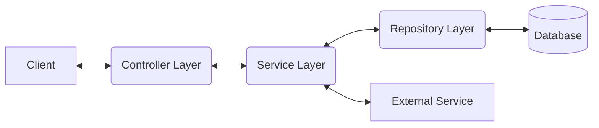

# Spring Boot Web Service Template

[](https://github.com/bagitag/kotlin-spring-boot-web-service-template/actions/workflows/build.yml)

[JaCoCo coverage](https://bagitag.github.io/kotlin-spring-boot-web-service-template/)

This is a template for a simple Spring Boot REST service written in Kotlin. It can be used to quickly bootstrap a new web service.

The project includes useful features and configurations to help you develop, maintain, and troubleshoot your service. For more details, see the [Features](.document/FEATURES.md) section.

---

# Table of Contents

- [Technical Overview](#technical-overview)
  - [Architecture](#architecture)
  - [Project Structure](#project-structure)
  - [Technology Stack](#technology-stack)
- [Getting Started](#getting-started)
  - [How to build the project](#how-to-build-the-project)
  - [How to run the application](#how-to-run-the-application)
  - [Configuration](#configuration)
- [Further documentation](#further-documentation)

# Technical Overview

## Architecture



## Project Structure

The project is organized into the following modules:

- **api**: Defines request and response structures for the service.
- **client**: Integrations with other services. See details: [CLIENT.md](template-project-client/CLIENT.md).
- **core**: Core application logic; bridges web, client, and persistence layers.
- **persistence**: Data access layer. See details: [PERSISTENCE.md](template-project-persistence/PERSISTENCE.md).
- **web**: Web layer (controllers, exception handling).
- **jacoco-report**: Generates an aggregated JaCoCo coverage report.

## Technology Stack
Kotlin, Spring Boot, Maven

### Database
Liquibase, PostgreSQL

### Testing
JUnit 5, MockK, Testcontainers

### Monitoring
Micrometer, OpenTelemetry, Prometheus, Grafana

### Code Quality
Detekt, Ktlint, JaCoCo

### DevOps & CI/CD
Docker, GitHub Actions

# Getting Started

## How to build the project

### Prerequisites

The application needs to connect to a database to be able to run the integration tests. By default, Testcontainers is used to start a database in a Docker container. If you do not have Docker installed please enable the development Maven profile, to use an in-memory database, by adding the following to the Maven command: ```-Pdev```

Further details about running tests can be found in [TESTING.md](.document/TESTING.md).

### Build the project

Maven is used as the build tool. To build the project, run the following command:

```mvn clean install```

If you do not have Maven installed, you can use the Maven Wrapper that is included in the project:

```bash
 ./mvnw clean install
```

### Other build commands (from fastest to slowest):

- Build the project without compiling the tests:

```mvn clean install -Dmaven.test.skip=true```

- Build without running the tests:

```mvn clean install -DskipTests```

- Build without the integration tests, running only the unit tests:

```mvn clean install -DskipITs```


## How to run the application

### Prerequisites

To be able to run the application, you must comply with the followings:
- Have Java installed on your machine. Supported version is 21.
- Have a running database. The application is configured to connect to a PostgreSQL database.
- Properly configure the application. See the [Configuration](#configuration) section for more information.

For local development, use the `dev` Spring profile to start the application with an in-memory database.

### Run the application

To run the application, execute the following command:

```mvn spring-boot:run```

If you do not have Maven installed, you can use the Maven Wrapper that is included in the project:

```bash 
 ./mvnw spring-boot:run
```

Another way to run the application is to use Docker Compose. The following command will start the required services as defined in the [Docker Compose file](docker-compose.yml):

```bash
 docker-compose up
```

## Configuration

Starting the application with the default Spring Boot profile will not work, as the application requires configuration to be set.  
This way the app cannot be started without proper configuration in production.

The minimum required configuration can be found in the [docker-compose.yml](./docker-compose.yml) file under the `environment` section of the `server` service.

The full list of configuration properties can be found in the `*-dev.properties` file in each module's `src/main/resources` directory.

# Further documentation

See the following documents for more information:

- [Development](./.document/DEVELOPMENT.md)
- [Features](./.document/FEATURES.md)
- [Observability](./.document/OBSERVABILITY.md)
- [Testing](./.document/TESTING.md)
